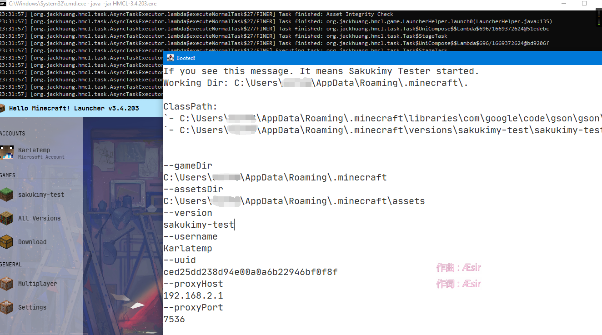
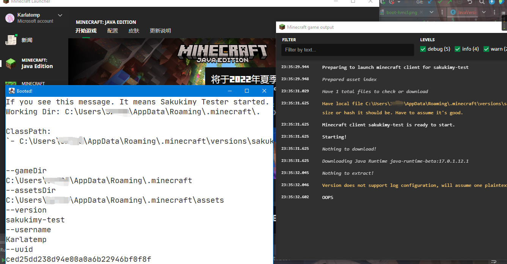
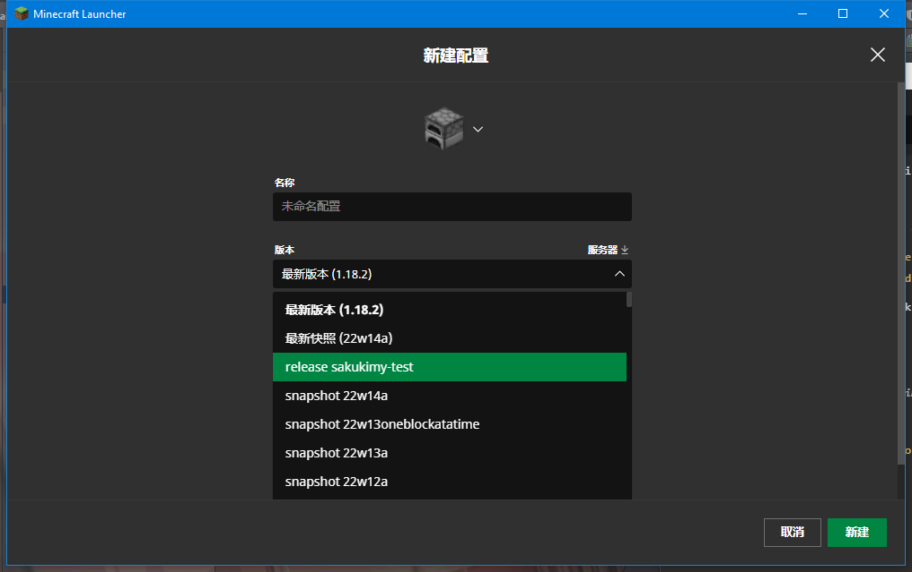

# Sakukimy

哦, 我们一起 MC 吧..... 等等这不是 MC!

---------

Sakukimy 是一款能将 Java 程序 (GUI) 打包成 MC 独立发行版 的工具

## 预览

<details>
<summary>点击展开</summary>

### Boot via HMCL



### Boot via Minecraft Launcher



</details>

## License

```text

   Copyright 2021-2022 KasukuSakura & Contributors.

   Licensed under the Apache License, Version 2.0 (the "License");
   you may not use this file except in compliance with the License.
   You may obtain a copy of the License at

       http://www.apache.org/licenses/LICENSE-2.0

   Unless required by applicable law or agreed to in writing, software
   distributed under the License is distributed on an "AS IS" BASIS,
   WITHOUT WARRANTIES OR CONDITIONS OF ANY KIND, either express or implied.
   See the License for the specific language governing permissions and
   limitations under the License.

```

## 使用

> Sakukimy 最低运行时要求: Java 11

### CLI

前往 [Releases](https://github.com/KasukuSakura/Sakukimy/releases) 下载最新版本.

运行 `java11 -jar sakukimy-cli.jar` 后就能得到帮助信息

### Maven

> TODO

### Gradle

> TODO

----

## 注意事项

由于 `官启 Minecraft Launcher` 并不支持 (由于未知原因) 动态下载 & 链接 依赖, 所以如果需要在官启也能运行的话, 请将依赖打包进您的程序内, 而不是让启动器去下载.

### 官启 Minecraft Launcher 添加配置

由于 `Minecraft Launcher` 并不会自动识别 `.minecraft/versions` 里的新版本, 所以需要手动添加版本

<details>
<summary>图片</summary>



</details>

--------

### LWJGL Support

> TODO

